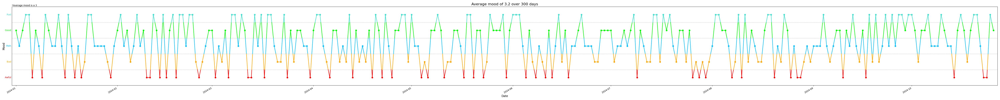

# Daylio Graph
Generates a graph of your moods for free users of daylio

# How to use
1. Export the csv from daylio and move it to root
2. Run the program $`python3 daylio.py daylio.csv`

### Note:
This is only intended to work with the default moods

# Example
The following example was generated with fake data. I am okay
